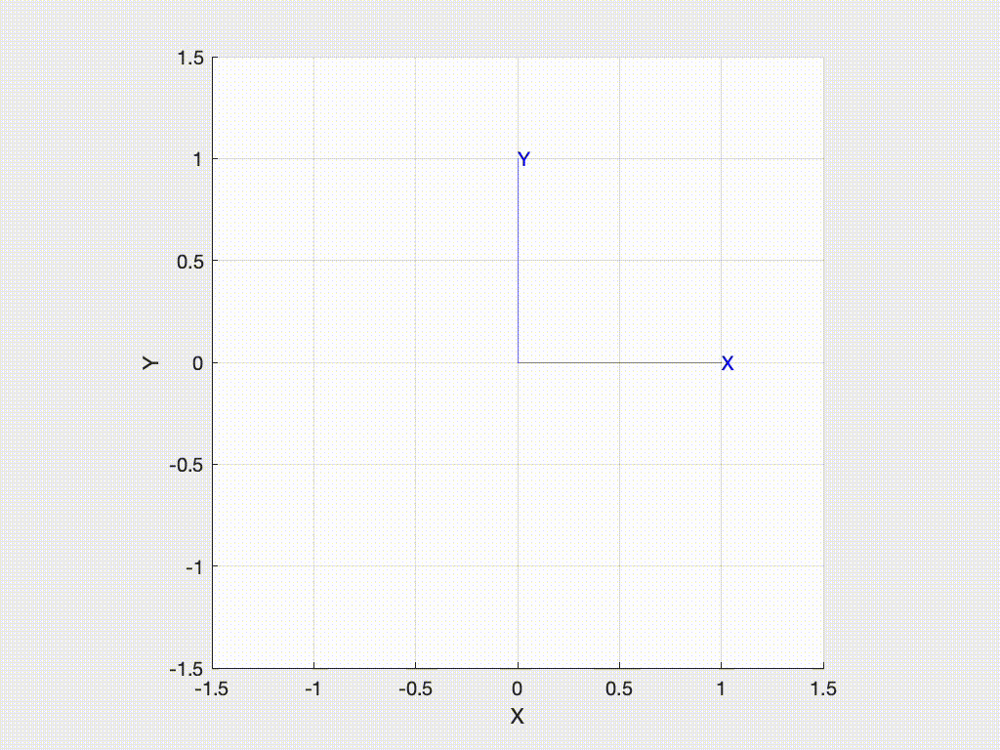
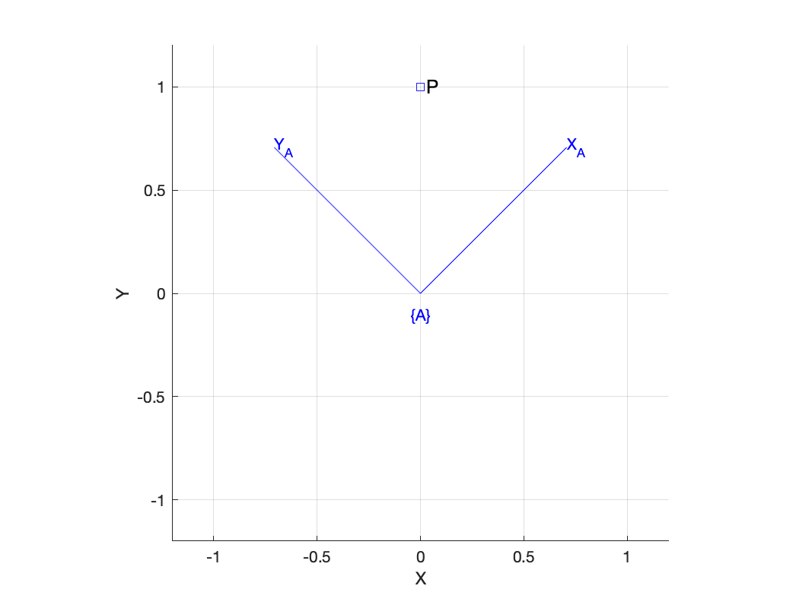
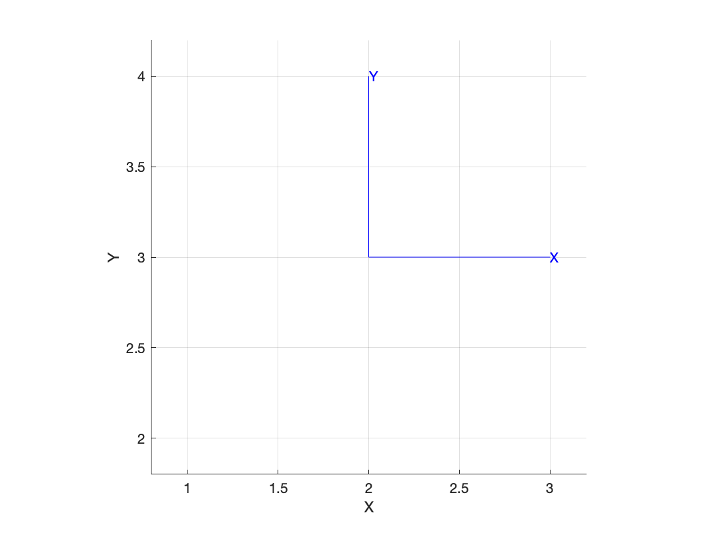
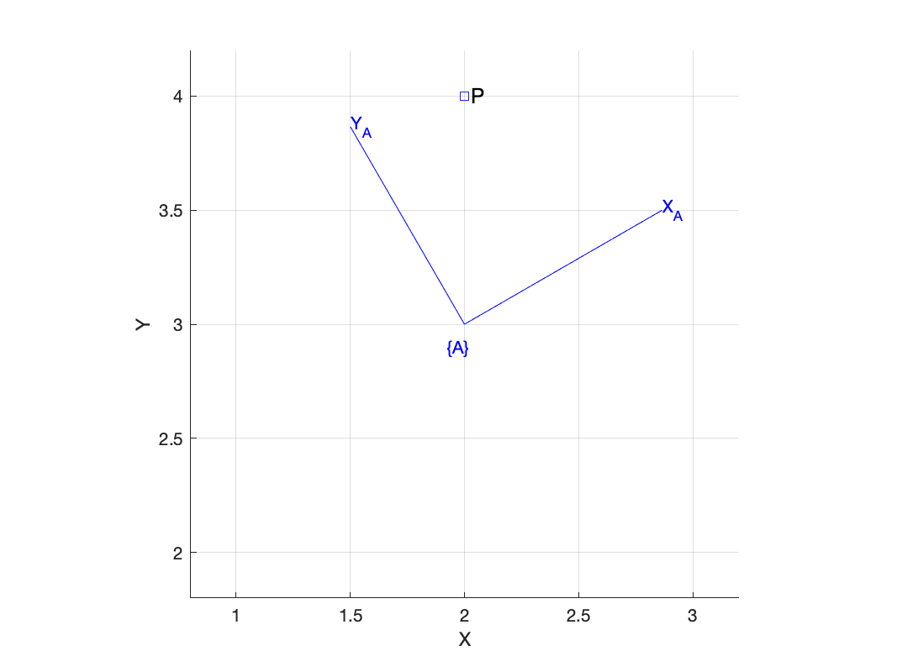
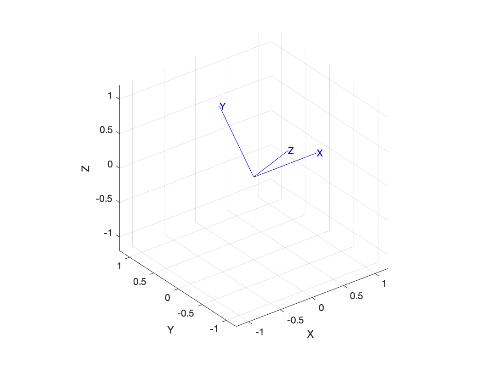
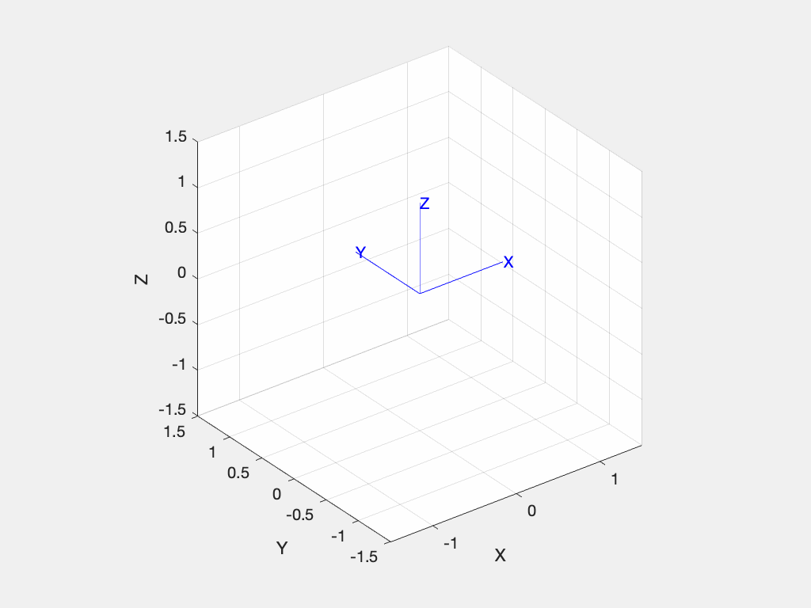

# Matrix functions

These functions return and operate on native MATLAB matrices.  They are the earliest part of the Toolbox (circa 1993) and their functionality has been superseded by a set of [classes](class.md) which also provide increased code readability and type safety.

You should use these matrix functions if:

- you want to strip away the complexity of classes, methods and overloaded operators to expose the underlying concepts, eg. for teaching.
- efficiency is a concern, the classes have some additional computational overhead
- you want to generate code using MATLAB codegen tools
- you want to use Simulink, the signals can be scalars or matrices, but not (yet) objects
- you want to use Octave

We use orthogonal rotation matrices (belonging to SO(2) or SO(3)) or homogeneous transformation matrices (belonging to SE(2) or SE(3)).  A sequence of matrices, perhaps representing some rotating or translating body, is represented by a stack of matrices, a 3-dimensional matrix, and we use the third index to denote the position in the sequence.

## 2D

Many problems in robotics, particularly in mobile robotics, can be considered in terms of position and orientation in the plane.  In 2D:

- position is defined by two quantities, typically denoted _x_ and _y_.
- orientation is defined by one angle, typically denoted &theta;.

### Orientation SO(2)

Orientation in 2D can be represented by a subset of 2&times;2 matrices that belong to the special orthogonal group of order 2 which in mathematical shorthand is written as SO(2).  These matrices have special properties:

- determinant equals +1
- inverse is given by the transpose

To create such a matrix representing a rotation of 45 degrees is
```matlab
>> R = rot2(45, 'deg')
R =
    0.7071   -0.7071
    0.7071    0.7071

>> whos R
  Name      Size            Bytes  Class     Attributes
  R         2x2                32  double 
```
which is a native MATLAB real matrix.

We can think of this matrix as defining a new coordinate frame, rotated counter-clockwise, with respect to the world coordinate frame.  To draw that frame is simply
```matlab
>> trplot2(R)
```
or animate the motion from the world frame to the rotated frame with
```matlab
>>> tranimate2(R)
```



We can interpolate between two orientations
```matlab
    R1 = rot2(20, 'deg')
    R2 = rot2(90, 'deg')
    R = trinterp(R1, R2, 0.5)
```
where the 0.5 indicates a rotation half way between the initial and final rotations.  This parameter can vary between 0, which would return `R1` and 1 which would return `R2`.

We can return a sequence of rotation matrices
```matlab
>> R = trinterp(R1, R2, 0:0.05:1);
>> whos R
  Name      Size              Bytes  Class     Attributes
  R         2x2x21              672  double 
```
which is a sequence of twenty one 2&times;2 rotation matrices smoothly changing from `R1` to `R2`.

Consider a point defined with respect to the frame {A}
```matlab
>> A = rot2(45, 'deg')
A =
    0.7071   -0.7071
    0.7071    0.7071
>> trplot2(A, 'frame', 'A')
>> P = [0 1]'
P =
     0
     1
>> plot_point(P, 'label', 'P')
```


Now the position of the point _with respect to_ the world frame is
```matlab
>> A'*P
ans =
    0.7071
    0.7071
```
which can be easily verified.


### Pose SE(2)

To represent position (as well as rotation) we need to use a slightly bigger matrix: a 3&tmes;3 homogeneous transformation matrix.  To represent a displacement of 2 in the x-direction and 3 in the y-direction is simply
```matlab
>> T = transl2([2, 3])
T =
     1     0     2
     0     1     3
     0     0     1
```
which represents the pose of a coordinate frame which we can show graphically



We can extract the translational component by
```matlab
>> transl2(T)
ans =
     2
     3
```

Now in the general case, the coordinate frame attached to our object of interest will have an arbitrary translation and rotation which can be obtained by multiplying together the relevant homogeneous transformation matrices
```matlab
>> A = transl2([2 3]) * trot2(30, 'deg')
A =
    0.8660   -0.5000    2.0000
    0.5000    0.8660    3.0000
         0         0    1.0000
```
which, reading left to right, is a translation by 2 in the x-direction and 3 in the y-direction _then_ a rotation by 30 degrees (the function `trot2` is like `rot2` but it returns a 3&tmes;3 homogeneous transformation matrix rather than a 2&tmes;2 rotation matrix, with the translational part set to zero).



Consider a point defined with respect to the frame {A}
```matlab
>> trplot2(A, 'frame', 'A')
>> P = [2 4]'
P =
     2
     4
>> plot_point(P, 'label', 'P')
```
which is shown above

Now the position of the point _with respect to_ the world frame is
```matlab
>> inv(A)*[P; 1]   % convert P to homogeneous form
ans =
    0.5000
    0.8660
    1.0000
```
which is a homogeneous vector -- the equivalent Euclidean vector is simply the first two elements, and this result can be easily verified from the figure above.  Note that the inverse of an SE(2) matrix is the regular matrix inverse, not the transpose.

To handle the conversion to and from homogeneous vector format we can use the Toolbox helper function

```matlab
>> homtrans(inv(A), P)
ans =
    0.5000
    0.8660
```


## 3D

Many problems in physics and robotics involve objects in everyday 3D space.
For this we need to consider the more complicated case of orientation in 3D

- position is defined by three quantities, typically denoted _x_, _y_ and _z_.
- orientation is defined by three angles, and there many options for denoting these.

### Orientation SO(3)

Orientation in 3D can be represented by a subset of 3x3 matrices that belong to the special orthogonal group of order 3 which in mathematical shorthand is written as SO(3).  These matrices have special properties:

- determinant equals +1
- inverse is given by the transpose

```matlab
>> R = rotx(45, 'deg')
R =
    1.0000         0         0
         0    0.7071   -0.7071
         0    0.7071    0.7071

>> whos R
  Name      Size            Bytes  Class     Attributes
  R         3x3                72  double              
```
which is a native MATLAB real matrix.

We can think of this matrix as defining a new coordinate frame, rotated about the world coordinate frame's x-axis.  To draw that frame is simply

```matlab
>> trplot(R)
```



or animate the motion from the world frame to the rotated frame with
```matlab
>>> tranimate(R)
```


and since we are rotating about the x-axis it doesn't move.

Just as for the 2D-case we can interpolate between two orientations
```matlab
>> R1 = rotx(20, 'deg')
>> R2 = roty(90, 'deg')
>> R = trinterp(R1, R2, 0.5)
```
where the 0.5 indicates a rotation half way between the initial and final rotations.  This parameter can vary between 0, which would return `R1` and 1 which would return `R2`.

We can return a sequence of rotation matrices
```matlab
>> R = trinterp(R1, R2, 0:0.05:1);
>> whos R
  Name      Size              Bytes  Class     Attributes
  R         3x3x21              672  double 
```
which is a sequence of twenty one 3&times;3 rotation matrices smoothly changing from `R1` to `R2`.


### Pose SE(3)

## Utility

### Transform composition and decomposition

Given a homogeneous transformation matrix 
```matlab
>> T = trotx(30, 'deg')
T =
    1.0000         0         0         0
         0    0.8660   -0.5000         0
         0    0.5000    0.8660         0
         0         0         0    1.0000
```
we can extract the 3&times;3 rotation matrix by
```matlab
>> R = t2r(T)
R =
    1.0000         0         0
         0    0.8660   -0.5000
         0    0.5000    0.8660
```

and conversely we can convert a 3&times;3 rotation matrix to a 4&times;4 homogeneous transformation matrix with zero translation by
```matlab
>> r2t(R)
ans =
    1.0000         0         0         0
         0    0.8660   -0.5000         0
         0    0.5000    0.8660         0
         0         0         0    1.0000
```

We can add a translation component expressed as a 3&times;1 vector

```matlab
>> T = rt2tr(R, [1 2 3]')
T =
    1.0000         0         0    1.0000
         0    0.8660   -0.5000    2.0000
         0    0.5000    0.8660    3.0000
         0         0         0    1.0000
```
or decompose a 4&times;4 homogeneous transformation matrix to a 3&times;3 rotation matrix and a 3&times;1 translation vector
```matlab
>> [R,t] = tr2rt(T)
R =
    1.0000         0         0
         0    0.8660   -0.5000
         0    0.5000    0.8660
t =
     1
     2
     3
```

These functions all operate on sequences expressed as 3-dimensional matrices.

### Printing and plotting

### Matrix and vector type checks
Sometimes we need to test if a MATLAB variable is of a particular type and we can use
```matlab
>> ishomog(T)
ans =
  logical
   1
>> isrot(T)
ans =
  logical
   0
>> isrot(R)
ans =
  logical
   1
>> isvec(t)
ans =
  logical
   1
```

Analagous functions with a 2 suffix can be used for the 2D case.

### Homogeneous coordinates

Euclidean translation is represented by a 3&times;1 vector
```matlab
>> t = [1 2 3]'
t =
     1
     2
     3
```
and can be converted to a 4&times;1 homogeneous vector
```matlab
>> e2h(t)
ans =
     1
     2
     3
     1
```
which allows it to be premultiplied by a 4&times;4 homogeneous transformation matrix.  The result will be another 4&times;1 homogeneous vector which can be converted to Euclidean form by
```matlab
>> h2e(ans)
ans =
     1
     2
     3
```

### Lie group support

A common operation is to build Lie algebra generator matrices.  For rotation these are 3&times;3 skew-symmetric matrices belonging to the group so(3)
```matlab
>> S1 = skew([1 2 3])
S1 =
     0    -3     2
     3     0    -1
    -2     1     0
```
a mapping from R<sup>3</sup> to R<sup>3&times;3</sup>.

An _augmented_ skew-symmetric matrices belonging to the group se(3)
```matlab
>> S2 = skewa([1 2 3 4 5 6])
S2 =
     0    -6     5     1
     6     0    -4     2
    -5     4     0     3
     0     0     0     0
```
a mapping from R<sup>6</sup> to R<sup>4&times;4</sup>.
These matrices, also known as Lie group generator matrices, have particular structure:

- a zero diagonal
- singular, ie. determinant is zero

The inverse operation is
```matlab
>> vex(S1)
ans =
     1
     2
     3
>> vexa(S2)
ans =
     1
     2
     3
     4
     5
     6
```
which are mappings from   R<sup>3&times;3</sup> to R<sup>3</sup>, and from  R<sup>4&times;4</sup> to R<sup>6</sup> respectively.

Most interestingly the exponential of these matrices are Lie group matrices representing pose, for example
```matlab
>> trexp( skew([0.3 0 0]) )
ans =
    1.0000         0         0
         0    0.9553   -0.2955
         0    0.2955    0.9553
```
is a rotation about of 0.3 radians about the x-axis.

The inverse is also true
```matlab
>> R = roty(0.7)
R =
    0.7648         0    0.6442
         0    1.0000         0
   -0.6442         0    0.7648
>> vex(trlog(R))
ans =
         0
    0.7000
         0
```


The functions `skew`, `skewa`, `vex` and `vexa` operated on matrices for the 2D and 3D case.  For exponentiation and logarithm the 2D-dimensional equivalents are `trlog2`, `trexp2`.

### Elementary transform sequences

trchain stuff

